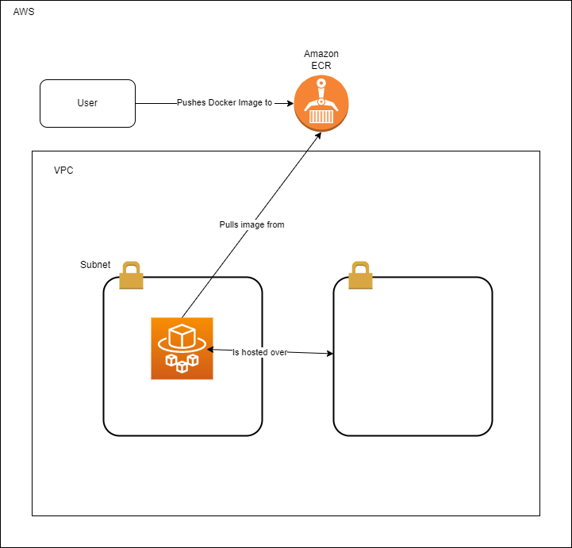

# Introduction

This is a sample application used to solve the SPH tech chalenge.


## Programming Task

Comments are included in the main.py to describe the efforts to solve the task.

## Deployment Task

Solution is pictured below. 


The Makefile describes the make commands to spin up the infrastructure to deploy the application. The terraform scripts have been designed to be able to deploy to different environments via loading different variable files.

```sh
make docker-build-push ECR_REGISTRY=ECR_REGISTRY ECR_REPOSITORY=ECR_REPOSITORY IMAGE_TAG=IMAGE_TAG
make tf-init env=env
make tf-plan env=env
make tf-apply-plan env=env
```

## Improvements that could be made

### Programming Task

- Hosting the storage of the past http status externally
- Create prometheus metric over /metric endpoint for the http status, so that we can see a time series graph for http status on grafana/kibana
- Threading/Forking(?) to increase the http endpoint speed

### Deployment Task

- Security group to increase security posture of ECS
- ALB to load balance requests to application if we were to scale the application
